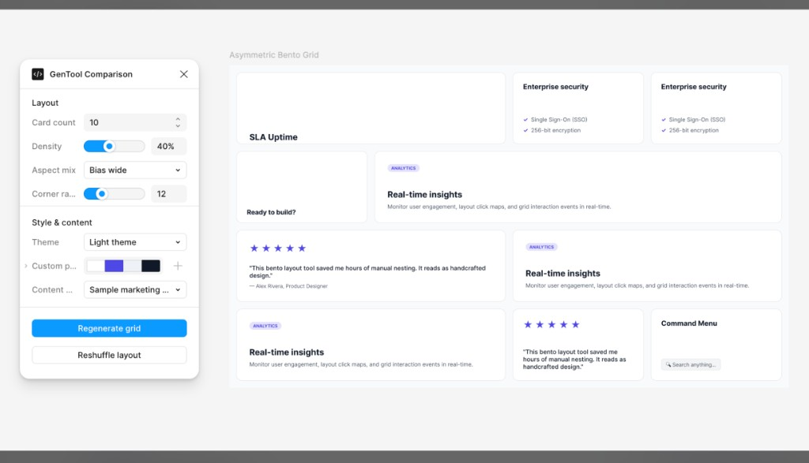

# Figma Plugin Factory

A workspace for building Figma plugins with Cursor. It ships a TypeScript + [FigUI3](https://github.com/rogie/figui3) scaffold, opinionated plugin patterns, and layered AI context (rules, docs, skills) so generated tools follow consistent structure and UI conventions.



Panel UI is built with **[FigUI3](https://github.com/rogie/figui3)** — Figma-native web components by [Rogie King](https://github.com/rogie). The template inlines FigUI3 into each plugin’s `ui.html`; see [`docs/08-figui3-ui.md`](docs/08-figui3-ui.md) for bundling and layout.

## What’s included

- **`template/`** — single-plugin scaffold with a stable manifest for iterative development
- **`plugins/<slug>/`** — factory mode for multiple plugins, each with its own manifest
- **`scaffold/`** — empty starting point copied into `src/` on reset
- **`reference/`** — working Generator and Action examples
- **`docs/`** — plugin API patterns, FigUI3 UI setup, output targeting, network access
- **`.cursor/rules/`** and **`.cursor/skills/`** — Cursor context loaded during generation

Generated plugins use [FigUI3](https://github.com/rogie/figui3) web components, commit-fire controls, state persistence on output nodes, relaunch buttons, and a 240px panel layout. See `docs/07-plugin-practices.md` for the full checklist.

## Prerequisites

- [Figma Desktop](https://www.figma.com/downloads/)
- [Node.js](https://nodejs.org/) 18+
- [Cursor](https://cursor.com/) (or another editor; the context files are Cursor-oriented)

## Setup

```bash
cd template
npm install          # installs deps and runs an initial build
npm run dev          # keep running while you work (optional but recommended)
```

In Figma: **Plugins → Development → Import plugin from manifest** → select `template/manifest.json`.

After the first import, file changes on disk update `src/code.js` and `src/ui.html` automatically when `npm run dev` is running. Close and re-run the tool in Figma to pick up changes. Re-import only when `manifest.json` changes.

## Development workflow

Figma loads compiled files from disk (`code.js`, `ui.html`). There is no live reload inside the plugin panel — you re-run the tool after the watcher writes new output.

| Command | When |
|---|---|
| `npm install` | Once per clone or plugin folder. Runs a full build via `postinstall`. |
| `npm run dev` | While editing. Watches `code.ts` and `ui.template.html`. |
| `npm run build` | One-off compile (CI, after `git pull`, or when the agent finishes a generation). |

Start `npm run dev` in a terminal tab and leave it open. Edit in Cursor; when the watcher finishes, re-run the tool in Figma.

## Generate a plugin

Reset the source, start a new chat, and prompt:

```text
Create a custom tool that …
```

Cursor reads `AGENTS.md`, writes `{pluginRoot}/src/code.ts` and `{pluginRoot}/src/ui.template.html`, runs the build, and you re-run the tool in Figma.

Reset between runs:

```bash
cd template && npm run reset
```

## Plugin factory

Use factory mode when you need several plugins side by side instead of resetting one harness:

```bash
npm run new-plugin -- org-chart       # create plugins/org-chart/, set active
npm run use-plugin -- org-chart       # switch active target
npm run list-plugins                  # list plugins and active slug
npm run use-plugin -- comparison      # back to template/
```

Import each plugin once: **Plugins → Development → Import plugin from manifest** → `plugins/<slug>/manifest.json`.

Cursor resolves the write target from `plugins/.active`. Details: `docs/11-plugin-factory.md`.

## Project layout

```
.
├── AGENTS.md                 # entry point for AI generation
├── .cursor/
│   ├── rules/                # always-on or file-scoped constraints
│   └── skills/               # opt-in recipes (color picker, open APIs, factory)
├── docs/                     # reference documentation
├── reference/                # worked Generator + Action examples
├── scaffold/                 # empty src/ starting point
├── scripts/                  # new-plugin, use-plugin, list-plugins
├── plugins/<slug>/           # one folder per plugin (factory mode)
└── template/                 # single-plugin harness
    └── src/
        ├── code.ts           # sandbox logic (overwritten on generation)
        ├── ui.template.html  # UI source (overwritten on generation)
        └── ui.html           # built output — do not edit by hand
```

## AI context layers

| Layer | Location | Role |
|---|---|---|
| Briefing | `AGENTS.md` | Hot path, trigger phrase, file edit boundaries |
| Rules | `.cursor/rules/*.mdc` | Non-negotiable constraints (philosophy, UI, code shape) |
| Docs | `docs/*.md` | Detailed patterns, API notes, troubleshooting |
| Skills | `.cursor/skills/*/SKILL.md` | Focused recipes for specific problems |
| Examples | `reference/` | End-to-end implementations to pattern-match |

Rules stay short. Docs hold rationale and code samples. Skills load only when a prompt needs them.

### Rules

| File | Loads when | Covers |
|---|---|---|
| `00-philosophy.mdc` | Always | Core tool contract, forbidden UI terms |
| `05-custom-tool-trigger.mdc` | Always | `Create a custom tool` workflow |
| `10-plugin-code.mdc` | Editing `code.ts` | Messages, `regenerate`, output targeting |
| `11-network-open-apis.mdc` | Network-related prompts | Public `fetch` patterns |
| `20-ui-html.mdc` | Editing UI files | FigUI3, commit-fire, panel layout |
| `30-manifest.mdc` | Editing `manifest.json` | Manifest stability |

### Skills

| Skill | Use for |
|---|---|
| `plugin-factory` | Creating or switching `plugins/<slug>/` folders |
| `color-picker-ui` | `<fig-input-color>` markup, CSS, popover resize |
| `open-api-tools` | Live data from public HTTP APIs |

### Documentation

| Doc | Topic |
|---|---|
| `docs/02-propskit-reference.md` | FigUI3 control catalog |
| `docs/07-plugin-practices.md` | State, relaunch, output targeting, errors |
| `docs/08-figui3-ui.md` | Bundling, spacing, color picker, auto-resize |
| `docs/09-plugin-structure-and-reset.md` | File boundaries and reset workflow |
| `docs/10-network-open-apis.md` | Network access without API keys |
| `docs/11-plugin-factory.md` | Multi-plugin workflow |

## Extending the context

When generation misses a pattern:

1. One-line, always-on fix → add to the relevant `.cursor/rules/*.mdc` file
2. Rationale + examples → extend `docs/`
3. Self-contained recipe → add `.cursor/skills/<name>/SKILL.md`
4. Changes to read order or file targets → update `AGENTS.md`
5. End-to-end pattern → add or extend `reference/`

## Build commands

Run inside `template/` or `plugins/<slug>/`:

```bash
npm run dev          # watch code.ts + ui.template.html (use while developing)
npm run build        # one-off: bundle UI + compile TypeScript
npm run bundle-ui    # regenerate ui.html from ui.template.html only
npm run reset        # restore src/ from scaffold/
```
